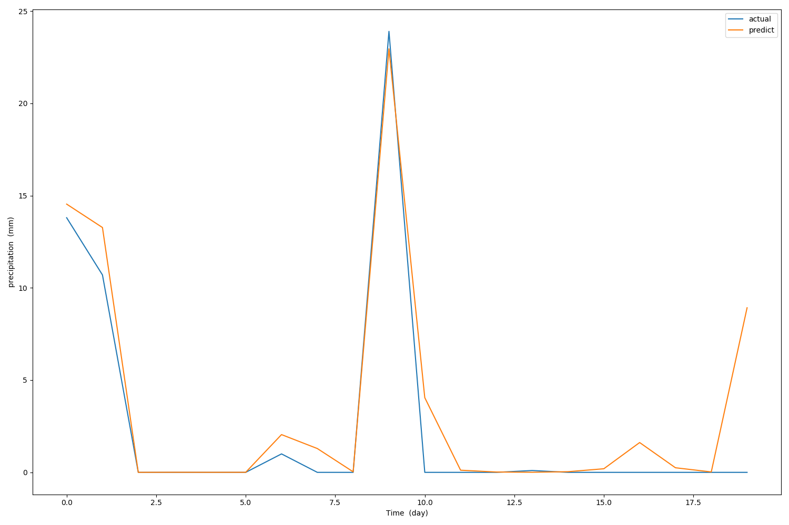
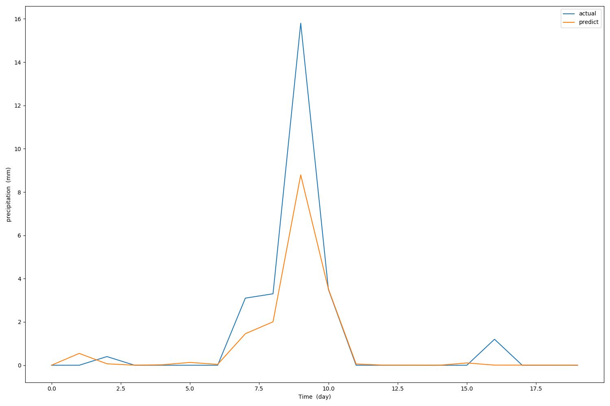
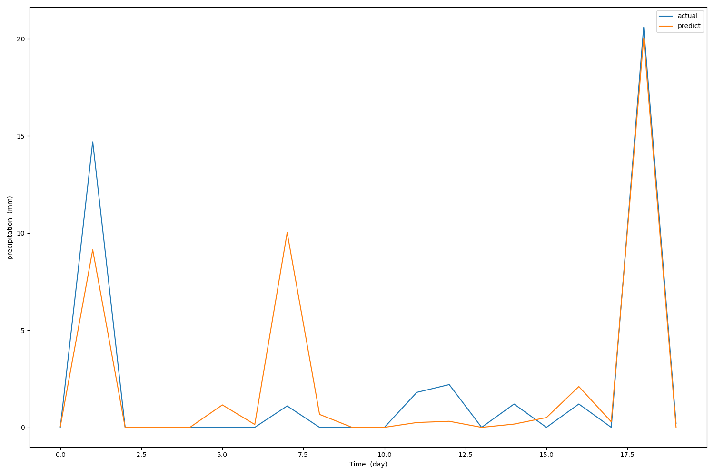
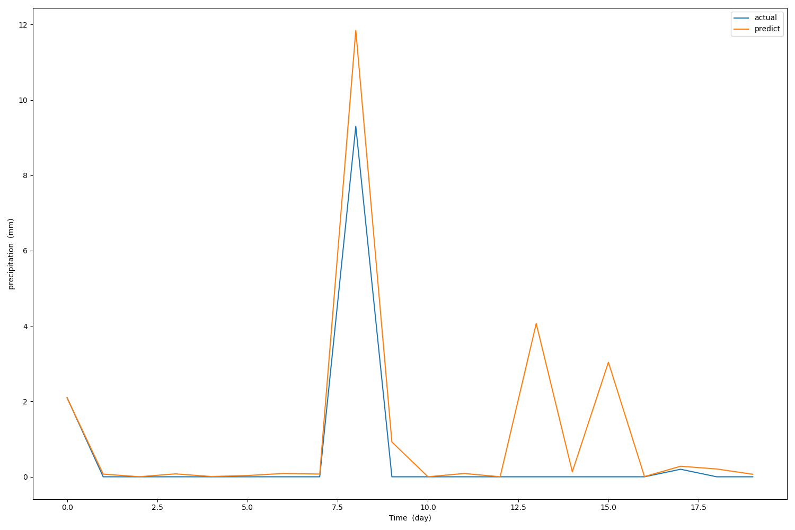

# graph gru

Reconstructed GRU, used to process the graph sequence.

## motivation

We have already seen the effectiveness of GRU / LSTM in time series prediction (not natural language processing), however, the original GRU / LSTM can only deal with the state transition of a single point.

In real life, a point cannot be completely unaffected by other points. For example, in a particle system, we cannot predict the next state of a particle based on the past state sequence of a particle. We need to know everything. Of course, usually we do n’t need to know exactly the position and velocity of all particles, because this is too inefficient, and instead it is a rougher sampling, which can be done by a graph neural network, and the state is represented by a set of graph embeddings. All that remains is to pass it into GRU/LSTM.

## implemention

The implementation can be simplified to the following formula:

$$ \mathbf{h}^{t+1}_v=\text{GRU}(\mathbf{h}^{t}_v,\sum_{𝑢∈𝑛𝑒[𝑣]} \mathbf{W}_{edge}𝐡_𝑢^𝑡)
 $$

It's similar with [GGNN]([GGNN](https://arxiv.org/abs/1511.05493)). The key part is get the edge weights, in the implemention, the weights be initialized to a matrix of shape (n, n), which n is the number of graph embeddings. But it can also be calculated by the attention mechanism. 

This matrix actually represents the probability of information transfer from other points to the current point. We know that at different times, there should be different probabilities. Therefore, calculating the probability through the attention mechanism should be the first choice.

## example

Imagine a sequence of graphs of length 10, each state is represented by 2 graphs embedded, we want to predict the next state of the graph sequence. 

```python
ggru = GraphGRU(input_size=(2, 2),
                hidden_size=8,
                num_layers=2)
input = torch.randn((1, 10, 2, 2)) # (batch_size, seq_len, n, d_i)
output, hidden = ggru(input)
print(output.shape)     # (1, 10, 2, 8)
print(hidden.shape)     # (2, 1, 2, 8)
```

## application scenario

There is a wide range of applications. Here is an example of using it for precipitation forecast. Specifically, the precipitation value of a monitoring station in the next 20 days is predicted by the precipitation records of more than 2,000 monitoring stations nationwide in the past 30 days. The following Some effects are shown:









Looks good.

## conclusion

Graph neural network has powerful state representation capabilities, and rnn has powerful sequence prediction capabilities, To a certain extent, GraphGRU can be regarded as learning high-dimensional spatial information through graph convolution. Unlike CNN, graph convolution can process data of any shape, which gives a wide range of applications. Therefore, the effect of graph sequence prediction mostly depends on the effect of graph neural network.